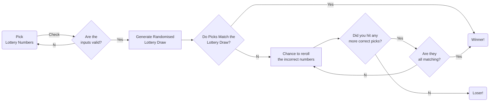

# Lottery Game
A game where you test your luck -- Pick some numbers and try to win!

```mermaid
flowchart LR
start(Pick \nLottery Numbers) --Check--> check{Are the \ninputs valid?}
check --No--> start
check --Yes--> draw[Generate Randomised\nLottery Draw]
draw --> match{Do Picks Match the\n Lottery Draw?}
match --Yes--> win(Winner!)
match --No--> reroll[Chance to reroll\nthe incorrect numbers]
reroll --> check2{Did you hit any\n more correct picks?}
check2 --No--> lost(Loser!)
check2 --Yes--> check3{Are they\n all matching?}
check3 --No--> reroll
check3 --Yes--> win
```

